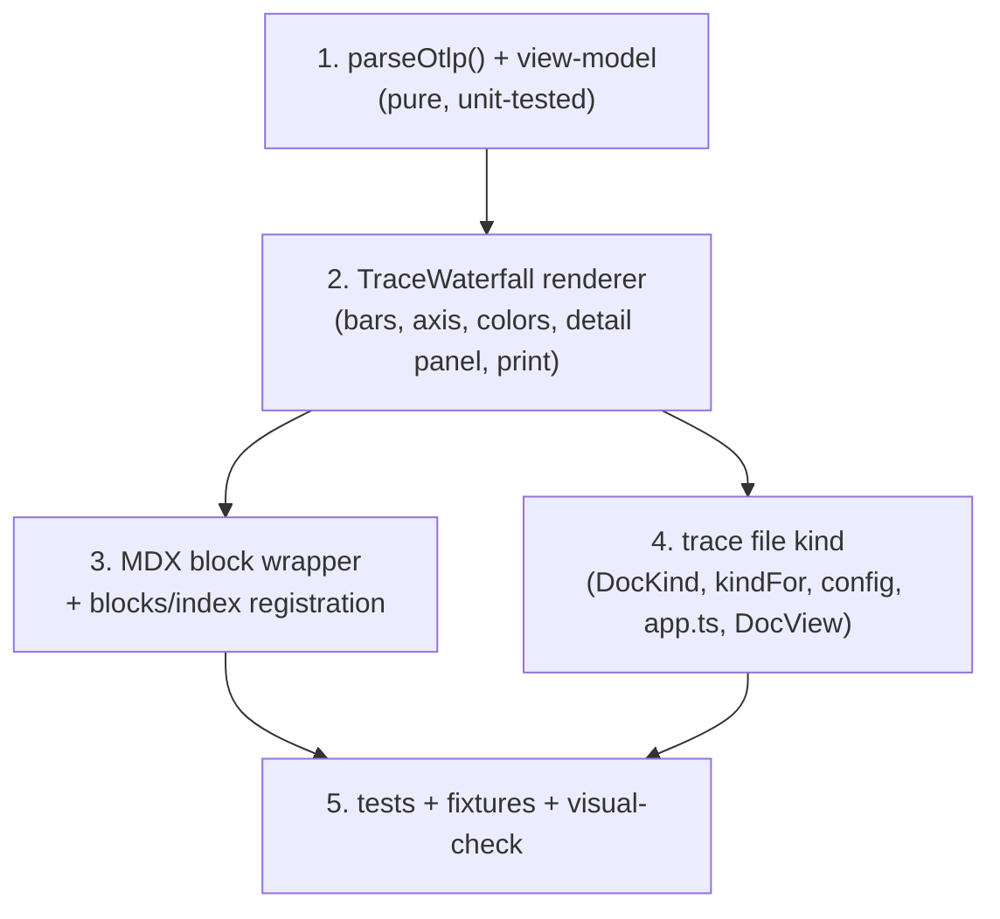

# Trace Waterfall — OTLP span timeline viewer

Render OpenTelemetry trace spans as a Grafana-style waterfall (nested Gantt) so a
debug doc can *draw* a trace instead of describing it. Feeds two ways: an inline
MDX `<TraceWaterfall>` block inside a `.mdx` debug narrative, and a standalone
`*.trace.json` file kind. Both share one renderer.

<Callout type="info" title="Intent">
When an agent (or a human) writes a debug doc and has a captured trace, they drop
the OTLP JSON in and plandeck draws a readable, printable waterfall — spans nested
by parent, laid on a shared time axis, colored by service, failures in red, with a
click-through detail panel.
</Callout>

## Goal + done-condition

**Done** = all of the following hold, verified by running the app (not just tests):

1. A `checkout.trace.json` OTLP file in the served folder appears in the sidebar
   and renders as a nested waterfall with a time axis.
2. The same trace embedded in an `.mdx` doc via `<TraceWaterfall>` renders
   identically (shared renderer).
3. Bars are colored by `service.name` with a legend; spans with `status.code =
   ERROR` are visibly red.
4. Clicking a span opens a detail panel: name, service, exact start/duration,
   status, attributes, events.
5. Invalid / malformed OTLP → a visible error card (never a blank or a crash);
   empty trace → explicit empty-state.
6. The waterfall survives **Print / Save as PDF** as static output (like Mermaid).
7. `visual-check` screenshots (light + dark) reviewed and clean.

## Scope

### In scope

- **OTLP JSON only** — the OpenTelemetry standard export shape
  (`resourceSpans[].scopeSpans[].spans[]`). This is our OTel-native default.
- A pure `parseOtlp()` → view-model (traces, spans, roots, time range, services).
- One `<TraceWaterfall>` renderer: nested bars, time axis, service color + legend,
  ERROR highlight, click → detail panel, print-friendly DOM/SVG.
- MDX block wrapper (reuses renderer) + registration in `blocks/index.ts`.
- `trace` file kind: `DocKind` union, `kindFor` compound-suffix detection, config
  discovery of `*.trace.json`, `app.ts` content serving, `DocView` case.
- Defensive redaction of secret-shaped attribute keys in the detail panel.
- Unit + component + e2e-fixture + visual-check coverage.

### Out of scope (non-goals for v1)

<Callout type="warn" title="Explicitly deferred">
- **Jaeger / Zipkin / custom formats** — OTLP only. A converter can come later.
- **Live tailing / remote fetch** — plandeck stays local, read-only, no network.
- **Multi-trace correlation, search, or filtering across traces** — one trace per
  view. (An OTLP payload with multiple `traceId`s renders each as a separate
  waterfall section, but no cross-trace linking.)
- **Flamegraph / span-metrics / aggregated latency views** — waterfall only.
- **Editing / re-timing spans** — read-only render.
</Callout>

## Risk surface

<Callout type="success" title="SAFE — no low-tolerance surface">
Client-side render of local JSON. No auth, no secrets handling, no DB, no
migration, no money, no network, no data-deletion. The one contract touch —
adding `"trace"` to the `DocKind` union — is **additive and backward-compatible**
(no existing member changes). Server change is limited to classification +
content serving of a new text-ish extension.
</Callout>

## Decomposition

One coherent feature, one PR. Mode-neutral slices (an executor may sequence them):



### 1. `parseOtlp()` — source of truth

Pure function `parseOtlp(json: unknown): ParsedTrace | ParseFailure`. Responsibilities:

- Walk `resourceSpans[].scopeSpans[].spans[]`; lift `service.name` from each
  `resource.attributes`.
- Normalize timestamps: OTLP `startTimeUnixNano` / `endTimeUnixNano` arrive as
  **strings** (nanosecond ints, may exceed `Number.MAX_SAFE_INTEGER`) — parse via
  `BigInt`, compute duration in ns as BigInt, then convert offsets to a `number`
  of ms **relative to the trace's min start** (relative offsets are safely small).
- Link `parentSpanId` → parent. Spans whose parent is absent from the payload are
  **surfaced as roots** (orphans are never dropped silently).
- Group by `traceId` (a payload may carry several traces).
- Carry through `status` (code + message), `attributes`, `events` for the panel.
- Bound span count with a cap (e.g. 2000); if exceeded, render what fits and set a
  `truncated: { shown, total }` marker the UI shows ("showing N of M spans") — no
  silent truncation.
- Any structural failure → a typed `ParseFailure { message }` the caller renders as
  an error card (mirrors `Mdx.tsx`'s ParseErrorCard pattern). Never throw past the
  component boundary.

<Decision title="Timestamp handling: BigInt parse, ms-relative render" status="accepted">
OTLP nano timestamps are strings that overflow JS `number`. Parse with `BigInt`,
keep absolute time in ns as BigInt for correctness, but expose each span to the
renderer as `{ startMs, durationMs }` **relative to trace start** — those offsets
are small enough for `number` and are what the waterfall actually needs. Storing
absolute epoch-ms as `number` would lose sub-ms precision and risk overflow.
</Decision>

### 2. `<TraceWaterfall>` renderer

- Layout: one row per span, indented by depth; a bar positioned left = `startMs`,
  width = `durationMs`, scaled to the container width against `[0, traceDurationMs]`.
  A top time axis with tick labels (`0ms … Nms`).
- Color: a stable hash of `service.name` → a Mantine palette color; a legend maps
  swatch → service. `status = ERROR` → red bar + red left border regardless of
  service color (error must win visually).
- Detail panel: click a span → a side/expandable panel (Mantine) with name,
  service, `startMs`/`durationMs`, status code + message, attributes table, events
  list. Panel is `vp-no-print` (see print below).
- **Print-friendly**: the bars are plain DOM (positioned divs) or inline SVG that
  renders in the print stylesheet, like `Mermaid`. Interactive chrome (detail
  panel, hover tooltips) carries `vp-no-print`; the waterfall picture itself
  prints. Fits the existing Print / Save-as-PDF export.
- Empty trace (0 spans) → an explicit empty-state card, not a blank canvas.

### 3. MDX block

`<TraceWaterfall>` wrapping a ` ```json ` fence child (same pattern as `HtmlBlock`
extracting its ` ```html ` child). Extract the fenced text, `parseOtlp()`, hand the
model to the shared renderer. Register in `src/client/blocks/index.ts` `components`.

### 4. `trace` file kind

<Decision title="Detect *.trace.json via compound-suffix, config-driven" status="accepted">
`kindFor` today derives the ext from the last dot, so `.trace.json` would read as
`.json`. Change ext extraction to be compound-aware: if the path (lowercased) ends
with `.trace.json`, treat the ext as `.trace.json`; else keep `slice(lastDot)`.
Add `.trace.json` to `BUILTIN_DEFAULTS.textFiles` so discovery finds it and a user
can disable the feature by removing it from `textFiles`. Map ext `.trace.json` →
kind `"trace"`. This keeps discovery + classification unified and config-driven
rather than hard-coding a second code path.
</Decision>

Touch list:
- `src/shared/types.ts` — `DocKind` gains `"trace"` (additive).
- `src/server/kind.ts` — compound-suffix ext extraction + `.trace.json → "trace"`.
- `src/server/config.ts` — `BUILTIN_DEFAULTS.textFiles` gains `.trace.json`.
- `src/server/app.ts` — `"trace"` served as text content (read file, return string);
  **not** prose-indexed (only md/mdx/txt are — matches `html`).
- `src/client/render/DocView.tsx` — `kind === "trace"` → `<TraceWaterfall raw={content}/>`
  wrapped in `ExportableDoc` so it prints.

## Telemetry

<Callout type="warn" title="Emission is N/A — and that is a conscious decision, not a skip">
plandeck is a **local, read-only, single-binary viewer with no network egress and
no backend to export to**. There is no request lifecycle, process boundary, or
async hop in this feature — it parses a local string and renders. So OTel span /
log / metric **emission does not apply**: there is nothing to propagate context to
and nothing to export to. Adding a custom telemetry stack here would violate the
"don't hand-roll observability" rule for zero value.
</Callout>

The observability obligation maps to **user-facing signal quality** instead — the
render-feature equivalent of "record the error, set status ERROR, do not swallow":

- **Invalid OTLP** → visible error card with the parse message (never blank/crash).
- **Empty trace** → explicit empty-state.
- **Orphan spans** (missing parent) → surfaced as roots, not dropped silently.
- **Truncation** → "showing N of M spans" marker when the span cap trips (no silent cap).

### Sensitive data (redaction contract applied to the render surface)

The renderer *displays* whatever attributes are in the OTLP payload, which can
contain secrets or PII. Author owns the content (local doc), but v1 applies the
**Tier-A universal redaction** defensively in the detail panel:

1. **Tier A — always redact (value masked, key kept visible):** attribute keys
   matching `token`, `password`, `secret`, `api_key` / `apikey`, `authorization`,
   `credential`, `private_key`, `bearer`, `cookie` (case-insensitive substring) →
   render value as `<redacted>`, key still shown. Honors the universal contract on
   the one surface where secrets could appear.
2. **Tier B (account handles — `service.name`, span/trace ids, user/tenant ids):**
   shown as-is — they are the debug join key and the whole point of the view.
3. **Tier C (KYC PII):** not specially detected in v1 — author-controlled content;
   noted as a future enhancement if real PII shows up in traces.
4. **Tier D:** none — the viewer emits no telemetry, so there is no per-field
   emission policy to ask about.

- **Metrics / histograms / cardinality:** N/A — no metric emission. No buckets, no
  labels, no cardinality decisions in a local viewer.
- **Acceptance:** the four signal-quality behaviors above are testable UI states
  (error card, empty-state, orphan-as-root, truncation marker) and are part of the
  done-condition — not tests-pass-alone.

<Callout type="info" title="Follow-up rule">
If this lands, capture the `.trace.json` kind + the OTLP view-model shape + the
Tier-A attribute-masking list as a `.claude/rules/trace-rendering.md` (path-scoped
to `src/client/render/` + `src/client/blocks/`) so the next session doesn't
re-derive it.
</Callout>

## Testing

- `parseOtlp` unit tests (fixtures): nominal multi-service trace; orphan-parent →
  root; ERROR-status span; empty payload; multi-trace payload; span-cap truncation;
  nano-timestamp BigInt precision; sensitive-attr masking.
- Component tests (RTL + real `MantineProvider` per client-conventions — do **not**
  mock `@mantine/core`): bars render, ERROR is red, click opens panel, masked attr
  shows `<redacted>`.
- e2e fixture `tests/e2e/fixtures/*.trace.json` — sidebar discovery + render.
- `visual-check`: add `trace-file` + `trace-block` scenarios, screenshot light +
  dark, review contrast / overflow / axis legibility.
- `bun run check` clean; excluded specs (`tests/e2e`, `tests/visual`) unaffected.

## Estimated effort

**M** — multi-file (parser + renderer + block + server classification + client
wiring + tests), single coherent PR, roughly a half-day. No cross-cutting decision
that locks the architecture for days (→ not L). SAFE surface (→ not fleet/ralph for
safety reasons).
