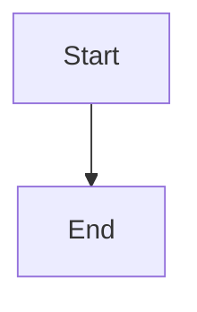

# Example Plan

This is a test document with custom blocks.

<Callout type="info" title="Note">
This is an informational callout for testing.
</Callout>

## Code example

```ts
const greeting = "hello world";
console.log(greeting);
```

## Diagram


