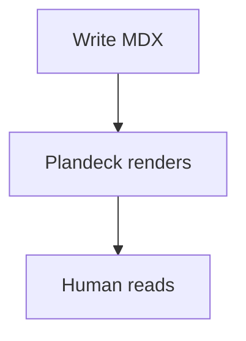

`.mdx` files get a small vocabulary of custom block components on top of regular
Markdown, so plan documents can express callouts, decisions, tabbed code, and
sandboxed HTML. Plain `.md` files render as standard Markdown (no JSX is
executed, for safety).

## Available blocks

| Block | Props | Description |
|---|---|---|
| `<Callout>` | `type` (`info` / `warn` / `success` / `danger`), `title` | Highlighted callout box |
| `<CodeTabs>` | children: `<pre>` blocks with `data-tab` | Tabbed code snippets |
| `<Decision>` | `title`, `status` (`proposed` / `accepted` / `rejected`) | Architecture decision record |
| `<HtmlBlock>` | `height` | Sandboxed HTML preview (scripts disabled) |

## Examples

```mdx
<Callout type="warn" title="Heads up">
  This migration is irreversible. Take a backup first.
</Callout>

<Decision title="Use SQLite FTS5 for search" status="accepted">
  In-memory, zero external services, good enough for local doc sets.
</Decision>
```

## Mermaid diagrams

Fenced code blocks tagged `mermaid` render as diagrams:

````markdown

````

Mermaid works in both `.md` and `.mdx` documents.
